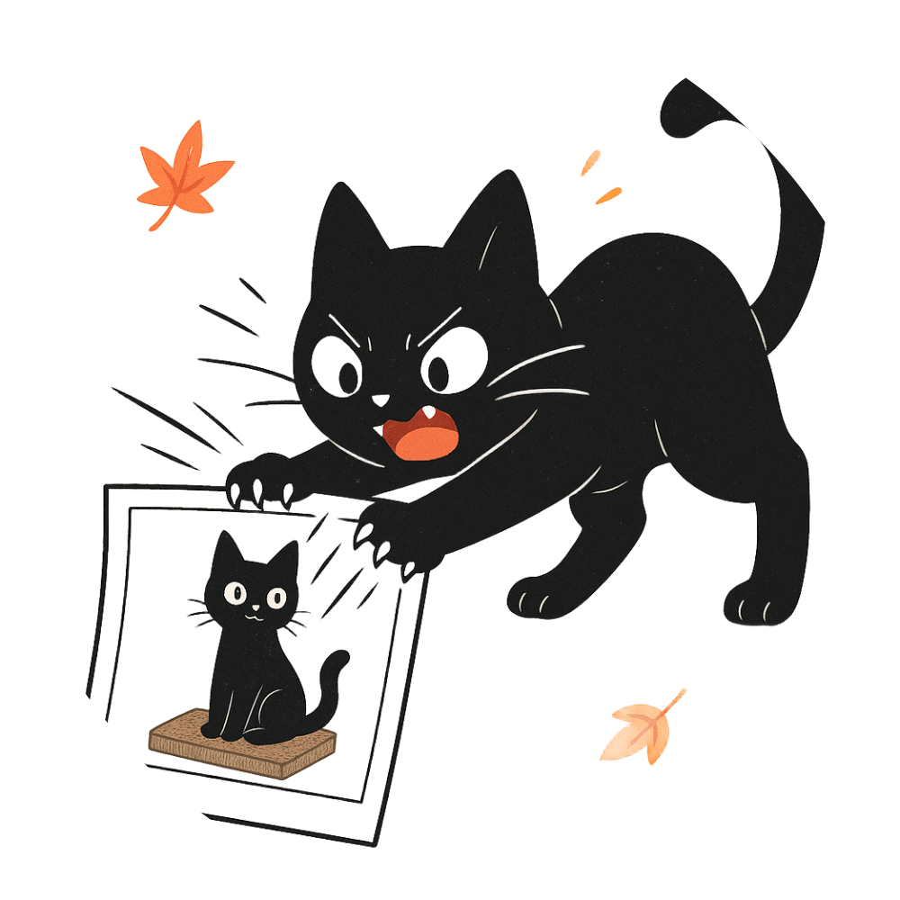
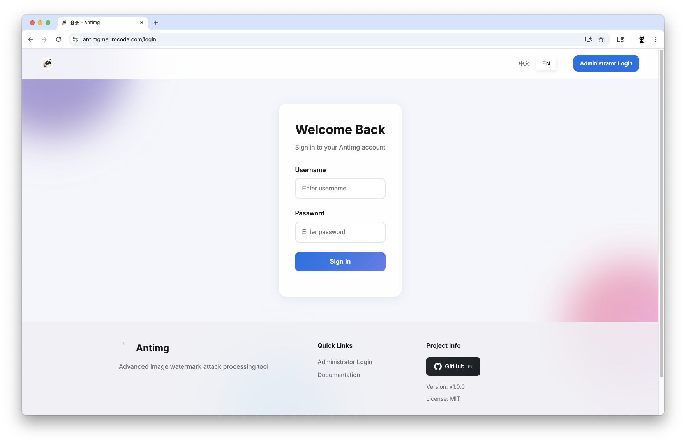
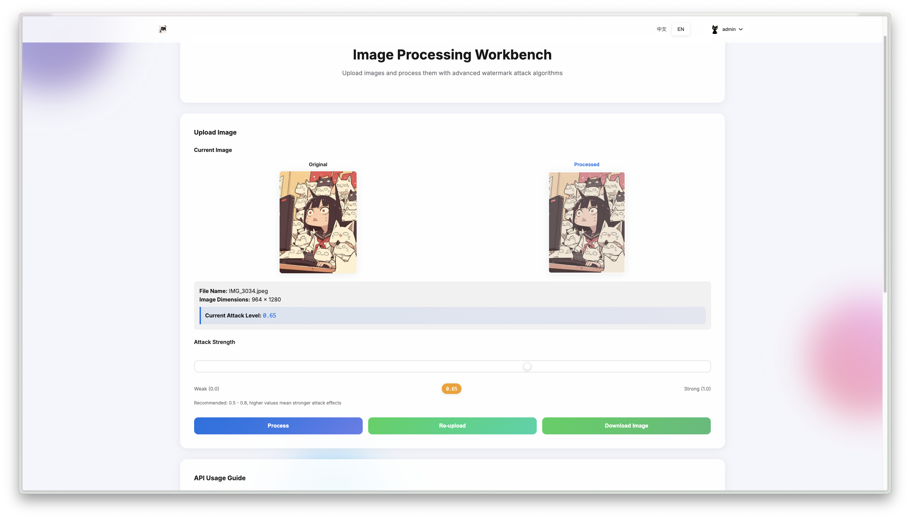

# Antimg - An Image Blind Watermark Attack Tool

[](https://github.com/Neurocoda/Antimg/actions/workflows/docker-image.yml)[](https://hub.docker.com/r/neurocoda/antimg) [](https://hub.docker.com/r/neurocoda/antimg-api)[](https://goreportcard.com/report/github.com/Neurocoda/Antimg) [](https://opensource.org/licenses/MIT)

<div align="center">
  
</div>

A image Blind Watermark attack processing tool with Docker deployment support and comprehensive security features. 

[中文文档](README_CN.md)


## ✨ Key Features

- 🎯 **Adversarial Adaptive Blind Watermarking**: Context-aware multi-stage processing algorithms
- 🔒 **Zero Trust Security**: JWT authentication, rate limiting
- 🐳 **Production-Ready Containers**: Pre-built multi-arch Docker images for AMD64, ARM64, ARMv7 architectures
- 🖥️ **Interactive Web UI**: Intuitive browser-based interface
- 🔌 **API Support**: Supports API calls to provide processing support for low-powered devices.
- 📦 **Format Support**: **JPEG**, **PNG**, **BMP**, **WebP** with automatic format detection
- 🍎 Shortcut: Provides Apple Shortcut for rapidly invoking APIs to process images.

**Live Demo:** [Demo Site](https://antimg.neurocoda.com)






## 🚀 Quick Deployment

### Docker Deployment (Recommended)

```bash
docker run -d \
  --name antimg \
  -p 8080:8080 \
  -e JWT_SECRET="your-32-character-ultra-secure-key" \
  -e ADMIN_PASSWORD="strong-password-here" \
  --restart unless-stopped \
  ghcr.io/neurocoda/antimg:latest
```


### Docker Compose Setup

```bash
# 1. Clone repository (optional for custom config)
git clone https://github.com/Neurocoda/Antimg.git && cd Antimg

# 2. Initialize environment
cp .env.example .env && nano .env  # Configure security parameters

# 3. Launch stack
docker-compose up -d --build
```


## 📖 User Guide

### Web Interface Workflow（In-Browser Processing）

1. Access `http://localhost:8080`
2. Upload source image (max 100MB)
3. Select processing intensity (0.1 - 1.0)
4. Download processed result


### API Integration（In-Server Processing）

Authenticated administrators can manage API tokens (view/regenerate) through the web console post-login.

> Apple Shortcut: https://www.icloud.com/shortcuts/778f82e2dd924a28a41ed0682ba5ff31

#### Authentication

```bash
curl -X POST http://localhost:8080/api/auth/token \
  -H "Content-Type: application/json" \
  -d '{"username":"admin","password":"YOUR_ADMIN_PASSWORD"}'
```

#### Image Processing
```bash
curl -X POST http://localhost:8080/api/v1/process \
  -H "Authorization: Bearer YOUR_JWT_TOKEN" \
  -F "image=@input.jpg" \
  -F "intensity=0.75" \
  -o processed_image.jpg
```

> **Note:** The term `API token` here does not refer to JWT. For details, refer to the web interface after administrator login.


### Reverse Proxy Setup (Nginx)

```nginx
server {
    listen 80;
    server_name watermark.example.com;

    location / {
        proxy_pass http://localhost:8080;
        proxy_set_header Host $host;
        proxy_set_header X-Real-IP $remote_addr;
        client_max_body_size 200M;
    }

    # HTTPS
    # listen 443 ssl;
    # ssl_certificate /etc/letsencrypt/live/example.com/fullchain.pem;
    # ssl_certificate_key /etc/letsencrypt/live/example.com/privkey.pem;
}
```


## ⚙️ Configuration Reference

### Environment Variables

| Variable         | Description                   | Default | Required |
| ---------------- | ----------------------------- | ------- | -------- |
| `PORT`           | Application port              | 8080    | No       |
| `JWT_SECRET`     | 32+ character JWT signing key | -       | Yes      |
| `ADMIN_USERNAME` | Administrator username        | admin   | No       |
| `ADMIN_PASSWORD` | Administrator password        | -       | Yes      |


### Security Architecture

- 🔐 JWT Authentication with Refresh Tokens
- 🛡️ Rate Limiting (API: 60 RPM, Processing: 20 RPM)
- 🕒 30s Processing Timeout
- 🔒 Non-root Container Execution
- 📦 Resource Isolation via Docker


## 🛠 Development Setup

### Prerequisites
- Go 1.21+ 
- Docker 23+


### Local Development

```bash
# Clone repository
git clone https://github.com/Neurocoda/Antimg.git
cd antimg

# Install dependencies
go mod download

# Set environment variables
export JWT_SECRET="your-development-jwt-secret-key-32-chars"
export ADMIN_PASSWORD="dev123456"

# Run application
go run main.go
```


## 🤝 Contributing Guide

We welcome contributions! Please follow these steps:
1. Fork the repository
2. Create feature branch (`git checkout -b feat/your-feature`)
3. Commit changes with semantic messages
4. Push to your fork (`git push origin feat/your-feature`)
5. Create descriptive pull request


## 📜 License

Distributed under MIT License. See `LICENSE` for full text.


## 🌍 Community & Support

- Bug Reports: [GitHub Issues](https://github.com/Neurocoda/Antimg/issues)
- Discussion Forum: [GitHub Discussions](https://github.com/Neurocoda/Antimg/discussions)
- Live Demo: [Demo Site](https://antimg.neurocoda.com)


---

[**Neurocoda**](https://neurocoda.com) © 2025. Created with ❤️ & Go and AI Assistant.

