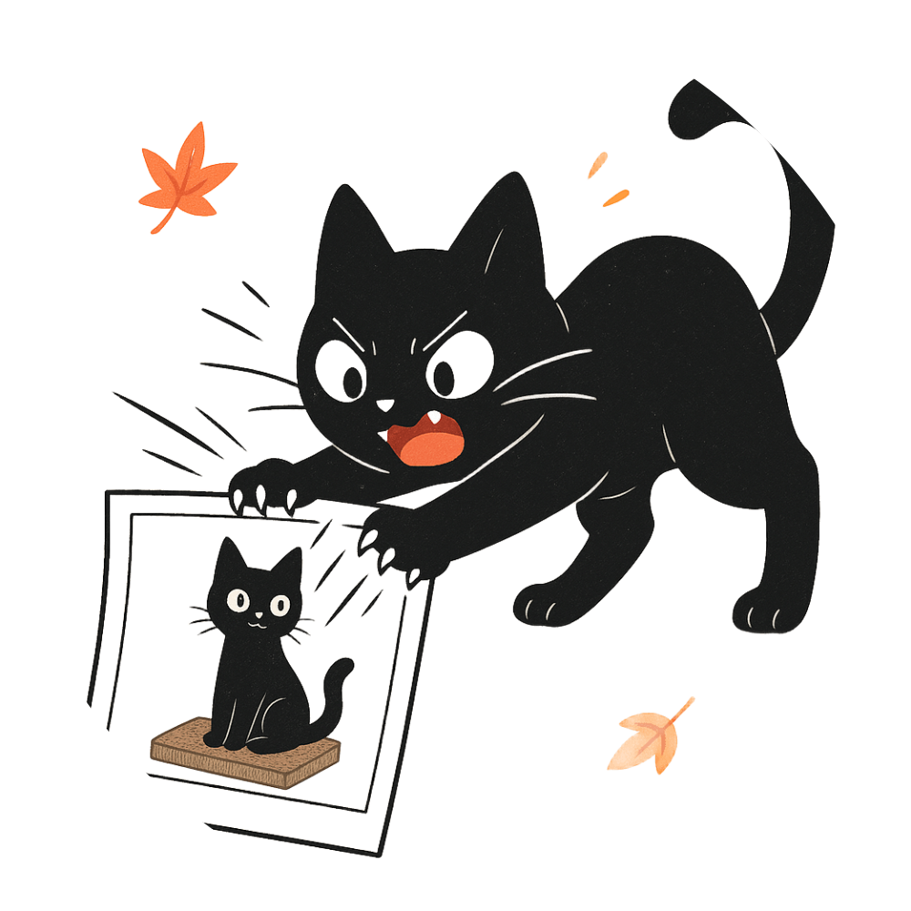
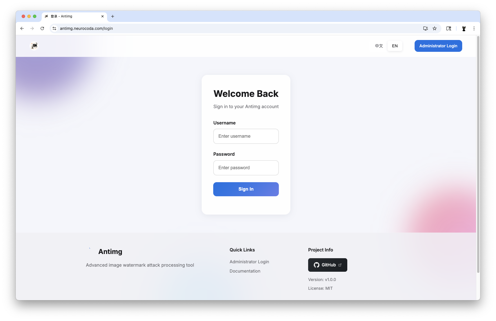
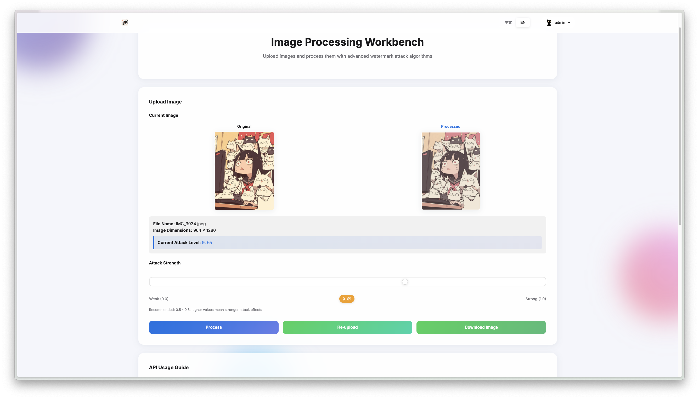
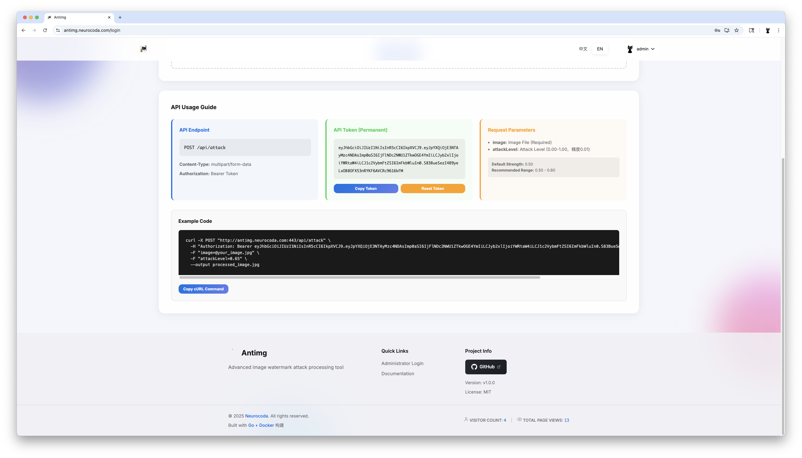

<div align="center">
  
  <h1 style="font-size: 2.5em; margin: 0; line-height: 1.2;">Antimg</h1>
  
  <h4 style="font-size: 1.3em; margin: 0.3em 0 1.2em; color: #666; font-weight: 400;">
    一个图片盲水印对抗工具
  </h4>

  <div style="margin: 1.8em 0 3em; display: flex; flex-wrap: wrap; gap: 8px; justify-content: center;">
    <a href="https://github.com/Neurocoda/Antimg/actions/workflows/docker-image.yml" style="text-decoration: none;">
      
    </a>
    <a href="https://hub.docker.com/r/neurocoda/antimg" style="text-decoration: none;">
      
    </a>
    <a href="https://hub.docker.com/r/neurocoda/antimg-api" style="text-decoration: none;">
      
    </a>
    <a href="https://goreportcard.com/report/github.com/Neurocoda/Antimg" style="text-decoration: none;">
       
    </a>
    <a href="https://opensource.org/licenses/MIT" style="text-decoration: none;">
      
    </a>
  </div>
  
  
</div>
支持 Docker 部署的图片盲水印对抗处理工具，具备完善的安全特性。

## ✨ 核心特性

- 🎯 **自适应盲水印对抗**：上下文感知的多阶段处理算法
- 🔒 **零信任安防**：JWT认证、请求频控
- 🐳 **生产级容器**：预构建AMD64/ARM64/ARMv7多架构镜像
- 🖥️ **交互式Web界面**：浏览器直用的可视化操作台
- 🔌 **提供 API 接口**：支持API调用，为低算力设备提供处理支持
- 📦 **格式通配**：自动识别 **JPEG/PNG/BMP/WebP **格式
- 🍎 **Shortcut**：提供 Apple Shortcut 用于快速调用 API 进行图像处理


**演示站点:** [Demo Site](https://antimg.neurocoda.com)








## 🚀 快速部署

### Docker部署（推荐方案）

```bash
docker run -d \
  --name antimg \
  -p 8080:8080 \
  -e JWT_SECRET="32位高强度密钥" \
  -e ADMIN_PASSWORD="管理员密码" \
  --restart unless-stopped \
  ghcr.io/neurocoda/antimg:latest
```


### Docker Compose方案

```bash
# 1. 克隆仓库（可选步骤）
git clone https://github.com/Neurocoda/Antimg.git && cd Antimg

# 2. 初始化配置
cp .env.example .env && nano .env  # 按需修改安全参数

# 3. 启动服务
docker-compose up -d --build
```


## 📖 使用指南

### 网页端流程（浏览器处理）

1. 访问 `http://localhost:8080`
2. 上传原始图片（最大100MB）
3. 选择处理强度（0.1 - 1.0）
4. 下载处理结果


### API集成（服务器端处理）

管理员登录 Web 控制台后可在"API管理"页面进行令牌的管理（查看/刷新）。

> Apple Shortcut: https://www.icloud.com/shortcuts/778f82e2dd924a28a41ed0682ba5ff31

#### 认证鉴权

```bash
curl -X POST http://localhost:8080/api/auth/token \
  -H "Content-Type: application/json" \
  -d '{"username":"admin","password":"管理员密码"}'
```

#### 图片处理

```bash
curl -X POST http://localhost:8080/api/v1/process \
  -H "Authorization: Bearer 你的 API 令牌" \
  -F "image=@原始图片.jpg" \
  -F "intensity=0.75" \
  -o 处理结果.jpg
```

> 注：这里的 `API 令牌` 不是指 JWT，详见管理员登录后的 Web 端。


### 反向代理配置（Nginx）

```nginx
server {
    listen 80;
    server_name watermark.example.com;

    location / {
        proxy_pass http://localhost:8080;
        proxy_set_header Host $host;
        proxy_set_header X-Real-IP $remote_addr;
        client_max_body_size 200M;
    }

    # HTTPS
    # listen 443 ssl;
    # ssl_certificate /etc/letsencrypt/live/example.com/fullchain.pem;
    # ssl_certificate_key /etc/letsencrypt/live/example.com/privkey.pem;
}
```


## ⚙️ 配置参考

### 环境变量

| 变量名           | 说明                        | 默认值 | 必填 |
| ---------------- | --------------------------- | ------ | ---- |
| `PORT`           | 服务端口                    | 8080   | 否   |
| `JWT_SECRET`     | JWT签名密钥（32+字符）      | -      | 是   |
| `ADMIN_USERNAME` | 管理员账户名                | admin  | 否   |
| `ADMIN_PASSWORD` | 管理员密码                  | -      | 是   |


### 安全架构

- 🔐 JWT认证（含刷新令牌机制）
- 🛡️ 请求频控（API 接口 60 次/分钟，处理接口 20 次/分钟）
- 🕒 30 秒处理超时锁定
- 🔒 非 root 容器运行
- 📦 Docker 空间隔离


## 🛠 开发环境

### 前置要求

- Go 1.21+ 
- Docker 23+


### 本地调试

```bash
# 克隆仓库
git clone https://github.com/Neurocoda/Antimg.git
cd antimg

# 安装依赖
go mod download

# 设置环境变量
export JWT_SECRET="开发用JWT密钥（32位字符）"
export ADMIN_PASSWORD="dev123456"

# 启动服务
go run main.go
```


## 🤝 贡献指南

欢迎贡献代码！请按以下流程操作：

1. Fork 仓库
2. 创建特性分支（`git checkout -b feat/新功能`）
3. 提交语义化 commit（`git commit -m 'feat: 新增...'`）
4. 推送分支到 fork 仓库（`git push origin feat/新功能`）
5. 创建详细说明的 PR


## 📜 开源协议

采用MIT开源协议，完整文本见`LICENSE`文件。


## 🌍 社区支持

- 错误反馈：[GitHub Issues](https://github.com/Neurocoda/Antimg/issues)
- 功能讨论：[GitHub Discussions](https://github.com/Neurocoda/Antimg/discussions)
- 在线体验：[演示站点](https://antimg.neurocoda.com)


---

[**Neurocoda**](https://neurocoda.com) © 2025. Created with ❤️ & Go and AI Assistant.
